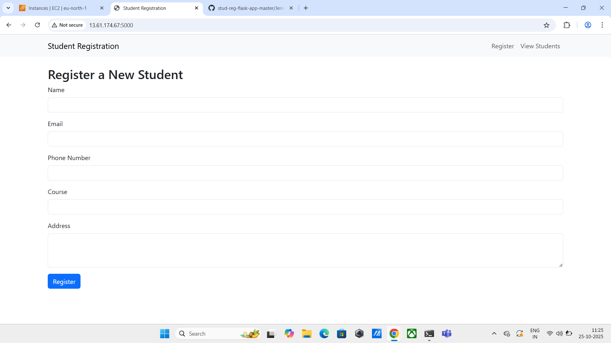
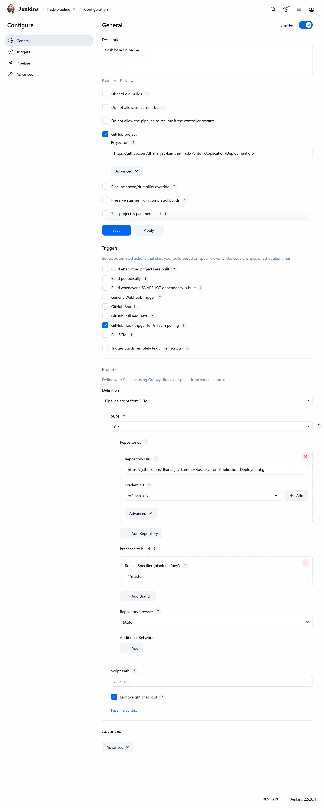
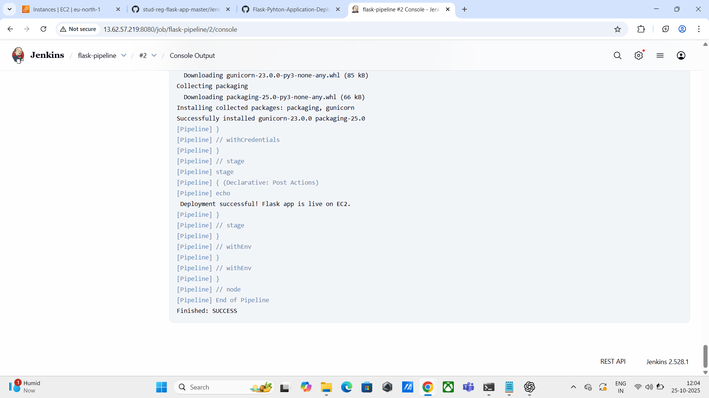
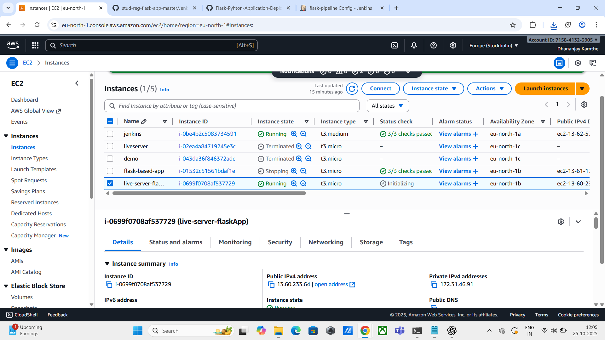
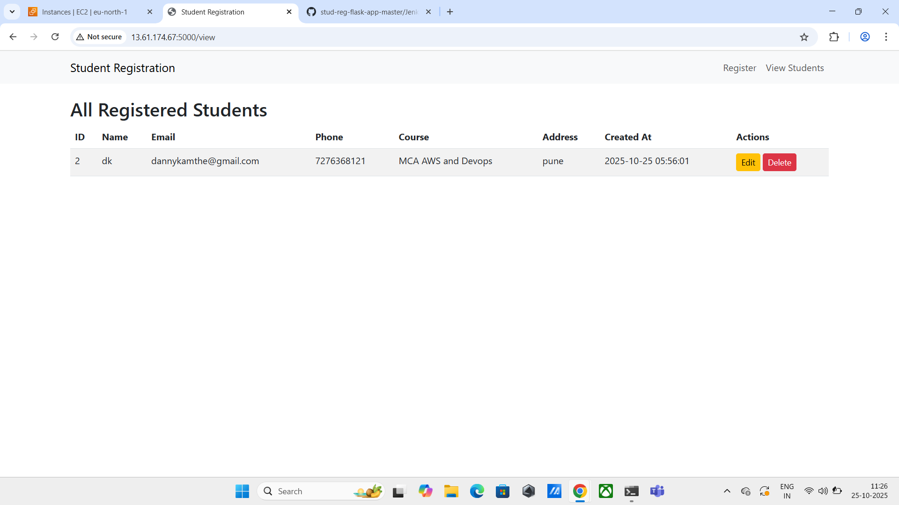

# 🧑🏻‍💻 Student Registration Web Application
(Flask + Jenkins CI/CD + AWS EC2 + MariaDB + Gunicorn)
## 📖 Project Introduction

The Student Registration System is a Python-based Flask web application built to demonstrate a complete CI/CD pipeline using Jenkins, integrated with AWS EC2 for deployment and MariaDB as the database.

The project highlights modern DevOps automation — from dependency installation to database configuration and application deployment — all executed automatically via a Jenkins pipeline.

## This project showcases:

* Continuous Integration with Jenkins

* Continuous Deployment to AWS EC2

* Automated MariaDB setup and schema initialization

* Flask backend served with Gunicorn

* Secure, credential-based SSH automation

## 🧬 Technology Stack

| Component       | Technology Used                       |
| --------------- | ------------------------------------- |
| **Backend**     | Python (Flask Framework)              |
| **Database**    | MariaDB (Auto-configured via Jenkins) |
| **Frontend**    | HTML, CSS (Flask Jinja templates)     |
| **Web Server**  | Gunicorn (on EC2)                     |
| **CI/CD Tool**  | Jenkins Pipeline                      |
| **os (Target)** | Amazon Linux 2 / Ubuntu EC2 Instance  |

---

## 🗂️ Repository Layout

```

stud-reg-flask-app-master/
│
├── app.py                → Core Flask application logic
├── run.py                → Entry point for launching the app
├── config.py             → Configuration file (app & DB settings)
├── models.py             → ORM / Database models for MariaDB
├── init.sql              → Script for initializing DB and tables
├── requirements.txt      → Python dependencies list
├── Jenkinsfile           → Jenkins CI/CD pipeline definition
└── templates/            → Frontend HTML templates (UI)
```

---

## ⚙️ Key Features

✅ Register new students
✅ Display all registered students
✅ Edit and delete existing student records
✅ Backend powered by MariaDB
✅ End-to-end Jenkins CI/CD automation
✅ Automated database creation and table setup
✅ Application deployment using Gunicorn on EC2

---

## 🧪 Prerequisites

#### Before starting, ensure the following are installed or configured:

#### Requirement	Description
* **Python 3.8+	Required for Flask and dependency management**
* **Jenkins (LTS)	For CI/CD pipeline execution**
* **Git	To clone repository from GitHub**
* **AWS EC2 Instance	Target deployment environment (Amazon Linux / Ubuntu)**
* **Jenkins Plugins**	
    * Git 
    * Pipeline  
    * SSH Agent  
    * Credentials Binding plugins


---

## 🖥️ Local Development Setup

#### Follow the below steps to run the project locally for testing or demonstration.

1️⃣ **Clone the Repository**

```bash
git clone https://github.com/dhananjay-kamthe/Flask-Pyhton-Application-Deployment.git

cd Flask-Pyhton-Application-Deployment
```

2️⃣ **Install Python and Pip**

For Amazon Linux or Ubuntu:
```bash
sudo yum install python3 -y
sudo yum install python3-pip -y
sudo yum install python3.12-venv -y
```

3️⃣ **Create and Activate Virtual Environment**

```bash
python3 -m venv venv
source venv/bin/activate       # On Windows: venv\Scripts\activate
```

4️⃣ **Install Required Packages**

 ```bash
pip install -r requirements.txt
pip install gunicorn
```

5️⃣ **Initialize Local Database (Optional)**

If you want to run locally with MariaDB/MySQL:

```bash
mysql -u root -p < init.sql
```

6️⃣ **Start the Flask App**

 ```bash
gunicorn run:app --bind 0.0.0.0:5000
 ```

**Access your application via:**

👉 http://<your_ip>:5000

---

## 🤖 Jenkins Pipeline — Full CI/CD Workflow

The **Jenkinsfile** defines an automated pipeline that orchestrates every step of the integration and deployment process.

| Stage                    | Description                                                               |
| ------------------------ | ------------------------------------------------------------------------- |
| **Checkout Code**        | Fetches latest source code from GitHub repository                         |
| **Install Dependencies** | Creates Python virtual environment and installs pip dependencies          |
| **Run Tests**            | Executes any unit tests defined under `/tests`                            |
| **Setup Database**       | Installs MariaDB on EC2, creates DB, user, and tables dynamically         |
| **Deploy to EC2**        | Copies project files via SCP, installs packages, and runs Gunicorn on EC2 |

---

## 🔑 Jenkins Environment Variables & Credentials

#### The Jenkins pipeline uses several credentials and environment variables to securely handle deployment and configuration.

| Variable                                  | Purpose                           | Source                 |
| ----------------------------------------- | --------------------------------- | ---------------------- |
| **PYTHON**                                | Python executable (e.g., python3) | Defined in Jenkinsfile |
| **DB_USER**, **DB_PASSWORD**, **DB_NAME** | Database credentials              | Defined in Jenkinsfile |
| **ec2-ssh-key**                           | Private SSH key for EC2 access    | Jenkins Credentials    |
| **ec2-host**                              | EC2 public IP / DNS               | Jenkins Credentials    |
| **app-dir**                               | Deployment path on EC2            | Jenkins Credentials    |

---

## 🛠️ Jenkins Configuration Steps

#### Step 1: **Add Required Credentials in jenkins**

Go to **Manage Jenkins → Credentials → Global → Add Credentials**, and create the following entries:

| ID            | Type                          | Example Value                                    |
| ------------- | ----------------------------- | ------------------------------------------------ |
| `ec2-ssh-key` | SSH Username with private key | Key to connect to EC2 (e.g., ec2-user)           |
| `ec2-host`    | Secret Text                   | e.g., `13.232.45.10`                             |
| `app-dir`     | Secret Text                   | e.g., `/home/ec2-user/stud-reg-flask-app-master` |

---

#### Step 2: **Create a Jenkins Pipeline Job**

Go to **Jenkins Dashboard** → **New Item** → **Pipeline**

Enter job name: **Flask Student Registration Deployment**

Select: **Pipeline from SCM**

SCM: **Git**

Repository URL:

https://github.com/dhananjay-kamthe/Flask-Pyhton-Application-Deployment.git


Branch: `main` or `master`

Script Path: `Jenkinsfile`

Save → Build the Job

---

#### Step 3: **Jenkins Build Process**

When triggered, Jenkins will automatically:

Clone the GitHub repository

Set up Python environment and install all dependencies

Connect to the target EC2 instance securely via SSH

Install MariaDB server and configure it with required schema

Transfer Flask project files to EC2

Install Gunicorn and launch the Flask app on port 5000

---

#### Step 4: **Validate Deployment**

SSH into the EC2 instance:

```bash
ssh -i your-key.pem ec2-user@<EC2_PUBLIC_IP>
```

Check if Gunicorn is running:

```bash
ps aux | grep gunicorn
```

Finally, open the browser and visit:

```
🌐 http://<EC2_PUBLIC_IP>:5000
```


---


## 🧠 Example Jenkinsfile (Deployment Stage)

```groovy
stage('Deploy to EC2') {
    steps {
        echo "🔹 Deploying Flask app to EC2..."
        withCredentials([
            sshUserPrivateKey(credentialsId: 'ec2-ssh-key', keyFileVariable: 'KEY_PATH', usernameVariable: 'SSH_USER'),
            string(credentialsId: 'ec2-host', variable: 'EC2_HOST'),
            string(credentialsId: 'app-dir', variable: 'APP_DIR')
        ]) {
            sh '''
                scp -i "$KEY_PATH" -o StrictHostKeyChecking=no -r Jenkinsfile app.py config.py init.sql models.py requirements.txt run.py templates venv \
                ${SSH_USER}@${EC2_HOST}:${APP_DIR}/
                ssh -i "$KEY_PATH" ${SSH_USER}@${EC2_HOST} "
                    cd ${APP_DIR} &&
                    source venv/bin/activate &&
                    pip install -r requirements.txt &&
                    pip install gunicorn &&
                    pkill gunicorn || true &&
                    nohup gunicorn run:app --bind 0.0.0.0:5000 --daemon
                "
            '''
        }
    }
}
```

---

## 🧩 Troubleshooting Guide

| Problem                           | Cause                            | Fix                                                                  |
| --------------------------------- | -------------------------------- | -------------------------------------------------------------------- |
| **ERROR 1064 (42000)**            | SQL syntax error                 | Check `init.sql` syntax, ensure password quotes are correct          |
| **ModuleNotFoundError**           | Missing dependency               | Reactivate venv and reinstall with `pip install -r requirements.txt` |
| **Permission denied (publickey)** | Incorrect SSH credentials        | Verify Jenkins SSH key setup and permissions                         |
| **Port 5000 already in use**      | Gunicorn process already running | Run `pkill gunicorn` before redeployment                             |


---

## 🖼️ Visual Overview (Suggested Screenshots)

1. **Project Overview**
   <p align="center">  </p>
   
3. **Jenkins Configuration**
   <p align="center">  </p>
   
5. **Jenkins Build Console Output**
   <p align="center">  </p>
   
7. **EC2 Running App**
   <p align="center">  </p>
    
11. **Studnet List Page with Delete and Update Option's**
    <p align="center">  </p>
    

---
## 🌟 Suggested Improvements

#### You can enhance this project further by integrating advanced DevOps practices:

| Enhancement                         | Description                                   |
| ----------------------------------- | --------------------------------------------- |
| 🐳 **Dockerization**                | Create Docker images for Flask app & MariaDB  |
| ☁️ **Infrastructure as Code (IaC)** | Use Terraform or Ansible for EC2 provisioning |
| 🔍 **Automated Testing**            | Integrate pytest for CI validation            |
| 🧾 **Reverse Proxy**                | Use Nginx for load balancing and HTTPS        |
| 📊 **Monitoring**                   | Add Prometheus + Grafana or CloudWatch        |
| 🔐 **Security**                     | Configure SSL with Let’s Encrypt              |

## 📜 License

This repository is intended solely for **educational and personal learning purposes**.
You’re free to clone, adapt, and modify it for academic or personal development.

👨‍💻 Author 
Dhananjay Kamthe...
